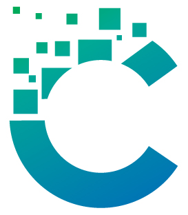

# Celeritas

## About The Project



Celeritas is a framework for building web applications on Go, 
rather similar to Ruby on Rails or Laravel but much more elementary level

Functions are:
* Ready to use models, create new with `celeritas-cli make model <name>`
* Ready to use sessions, after `celeritas-cli make session`
* Ready to use auth, after `celeritas-cli make auth`
* Ready to use mail service after `celertias-cli make mail <template-name>`
* Migrations with `celeritas-cli make migration <name>`

More info with `celeritas-cli help`

### Built With

* Golang

## Getting Started

```shell
go install github.com/barash-asenov/celeritas/cmd/celeritas-cli@v0.0.3

celeritas-cli new my-awesome-app
```

This will create the skeleton celeritas app that you can start work with

### Prerequisites

Go installed on machine.
Primarily tested on Linux machine. On MAC possibly will work
but on Windows will require some adjustments

## Acknowledgments

* This project is made while following a tutorial from [Dr. Trevor Sawler](https://www.udemy.com/user/trevor-sawler/). Therefore
the project and all structure is highly similar to the following course [Let's build a Go version of Laravel](https://www.udemy.com/course/lets-build-a-go-version-of-laravel/)


